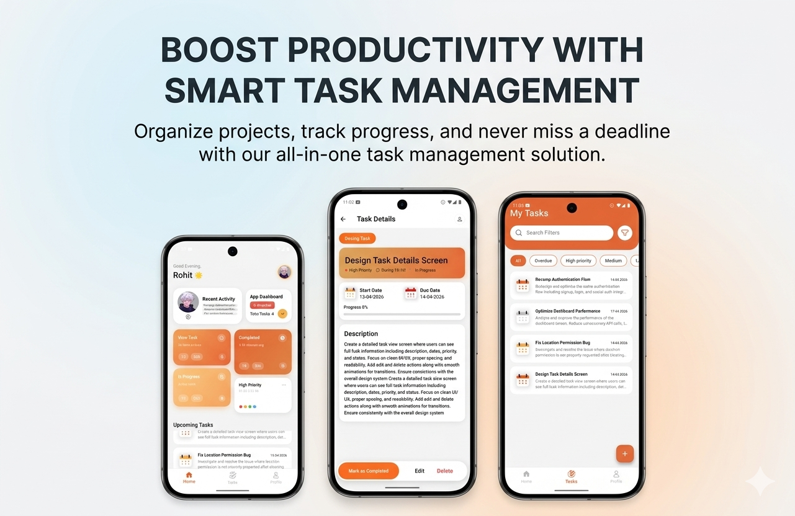

<p align="center">
	
</p>

<h1 align="center">BOOST PRODUCTIVITY WITH SMART TASK MANAGEMENT</h1>

<p align="center">
Organize projects, track progress, and never miss a deadline with our all-in-one task management solution.
</p>

---

samples, guidance on mobile development, and a full API reference.

# Prioro

Prioro is a cross-platform task management app built with Flutter. It helps users organize, track, and manage their daily tasks efficiently. The app features authentication (email/password & Google), task CRUD, filtering, search, and a modern, responsive UI. All user data is securely stored in Firebase.

---

## 🚀 Getting Started

### Prerequisites
- [Flutter SDK](https://docs.flutter.dev/get-started/install) (3.11.0 or higher)
- Dart SDK (comes with Flutter)
- A Firebase project (for your own deployment)

### Setup
1. **Clone the repository:**
	 ```bash
	 git clone https://github.com/rhitverse/Prioro
	 cd prioro
	 ```
2. **Install dependencies:**
	 ```bash
	 flutter pub get
	 ```
3. **Firebase setup:**
	 - The app uses Firebase for authentication and Firestore for data storage.
	 - Default Firebase configs are provided in `lib/firebase_options.dart` and `android/app/google-services.json`.
	 - To use your own Firebase project:
		 - Create a Firebase project at [Firebase Console](https://console.firebase.google.com/).
		 - Add Android/iOS/Web apps and download the config files.
		 - Replace the existing `google-services.json` (Android), `GoogleService-Info.plist` (iOS), and update `firebase_options.dart` using the [FlutterFire CLI](https://firebase.flutter.dev/docs/cli/).
	 - Enable **Authentication** (Email/Password, Google) and **Cloud Firestore** in your Firebase console.

4. **Run the app:**
	 ```bash
	 flutter run
	 ```
	 You can run on Android and iOS.

---

## 🔥 Firebase Integration
- **Authentication:** Uses `firebase_auth` for email/password and Google sign-in.
- **Database:** Uses `cloud_firestore` to store user tasks, linked by user ID.
- **Configuration:** All Firebase options are managed in `lib/firebase_options.dart`.

---

## 🏗️ Architecture
- **State Management:** Uses [GetX](https://pub.dev/packages/get) for dependency injection, navigation, and state.
- **Modular Structure:**
	- `auth/` — Authentication logic (controllers, repositories, providers)
	- `features/app/` — Main app features (screens, widgets, controllers)
	- `assets/` — Images, SVGs, and data assets
- **Repository Pattern:** Data access (e.g., Firestore) is abstracted via repositories.
- **UI:** Modern Material 3 design, responsive layouts, and custom widgets.

---

## 📁 Folder Structure

```
lib/
	main.dart                # App entry point, Firebase init, GetX setup
	firebase_options.dart    # Firebase config for all platforms
	colors.dart              # App color definitions
	auth/
		controller/            # AuthController (GetX)
		repository/            # AuthRepository, providers
	features/
		app/
			data/                # App-level data/constants
			screens/
				home/              # Home screen & widgets
				Login/             # Login/signup screens & widgets
				profile_screen.dart# User profile screen
				task/              # Task CRUD screens, controllers, widgets
			widgets/             # Shared widgets (e.g., bottom nav bar)
assets/
	images/                  # App images
	svg/                     # SVG icons
	data/                    # Sample data (e.g., tasks.json)
```

---

## 📚 Useful Commands
- `flutter pub get` — Install dependencies
- `flutter run` — Run the app
- `flutter build <platform>` — Build for release

---

## 📝 License
This project is for learning and demo purposes. Replace Firebase configs before production use.
